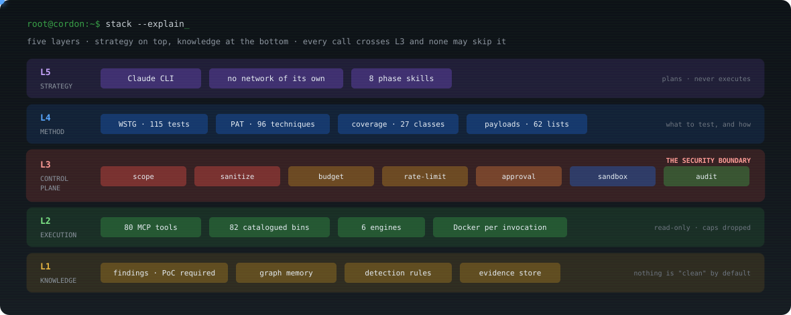
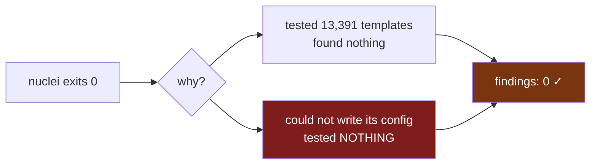

<div align="center">



**An agentic VAPT orchestrator where the control plane — not the model — is the security boundary.**

[](#development)
[](#every-tool-it-drives)
[](#every-tool-it-drives)
[](#quick-start)
[](#why-this-is-not-another-scanner-wrapper)
[](LICENSE)

</div>

> [!WARNING]
> **Authorized testing only.** Owned assets, an in-scope bug bounty program, or org
> assets with documented written approval. The `scope.yaml` you write **is** the
> authorization boundary, and the server refuses every request that falls outside
> it. This tool will not help you test something you have no permission to test.

---

## The one-paragraph version

Most AI security tools give a model a shell and a system prompt telling it to
behave. Cordon gives the model **no shell at all**. Every capability is an MCP
tool that passes through a fixed sequence — scope, sanitize, budget, rate-limit,
approval, sandbox, parse, audit — enforced in code, server-side, with no path
that skips a step. The model supplies strategy. The control plane decides what is
permitted. **A jailbroken prompt cannot reach the network.**

---

## The whole system in one picture



Every call descends from L5 to L2 and crosses **L3**. There is no code path that
routes around it — not a wrapper, not a chained validator, not the unattended
pipeline.

<div align="center">

### One tool call, end to end



### The engagement pipeline — each phase feeds the next



</div>

---

## Why this is not another scanner wrapper

Six design decisions, each of which came from something breaking in production.

### 1. Absence is not a clean result

This is the whole thing. A killed scan, a tool that could not write its config,
and a genuinely secure target all produce **zero findings** — and zero findings
reads as good news.



Both branches used to print the same result. Every wrapper now distinguishes
**tested and clean** from **not tested**, and says which in words:

> *"zero findings here means UNTESTED, not clean."*

Twenty-five instances of this defect have been found and fixed in this codebase
— including `nuclei` exiting **0** while unable to create its config directory,
and a command-injection tool that discarded its own target flag for the
project's entire life and reported "no injectable parameter" every time.

### 2. The scope file is an authorization record, not configuration

`scope.yaml` is transcribed by hand from the program's published policy. The
installer **refuses to create one for you** — it used to copy a template that
declared `authorization: bug-bounty` and a `fetched_at` date nobody had earned,
and three separate green ticks then confirmed it.

An absent scope is a correct state. A fabricated one is not.

### 3. Rate limits come from the program, never from a literal

The limiter charges per **request**, not per tool call — so a scanner with its
own thread pool cannot out-run the published ceiling while the audit log shows
one compliant call. Every rate flag is derived from `scope.rules`, then clamped
to what the binary actually accepts.

### 4. Tools are resolved by identity, not by PATH order

`pip install nuclei` gets you a 2018 Kaggle package. `slither` on PyPI is a
children's Scratch-for-Python toy. Kali's `medusa` is a password brute-forcer;
ours is a fuzzer. Cordon executes each candidate and keeps the one that
identifies itself — and never "fixes" a collision by uninstalling your software.

### 5. Health checks run where the tool runs

`cordon doctor` executes every tool **inside the container it will actually
run in**, under the real read-only root and dropped capabilities. Checking the
host copy answers a question about a different program — that is how tools
shipped broken for days behind a green tick.

### 6. No PoC, no finding

`Finding.confirm()` requires reproduction steps **and** an observed result. AI
triage may rank, downgrade and drop; a taskflow that declares a `confirm`
verdict is rejected at load time. Scanner output is a *candidate*, permanently,
until a human or a validator proves it.

---

## Quick start

```bash
git clone https://github.com/iamsecure1920/Cordon-AI.git && cd Cordon-AI
./bootstrap.sh
```

That is the whole install. `bootstrap.sh` is idempotent and is also the repair
path: system packages, Go and Python runtimes, Docker enabled at boot, the
Cordon package, the tool suite, **the `cordon:latest` image**, the per-tool
images, then `cordon doctor`.

Budget **30–45 minutes** for a first run. Needs ~15 GB free and Python ≥ 3.11.

| Flag | Effect |
| --- | --- |
| `--no-build` | skip the image build (≈46 tools then run on the host) |
| `--no-images` | skip images entirely — no container isolation |
| `--no-tools` | package only |

> [!NOTE]
> `cordon:latest` is built from this repo's `Dockerfile` and is **not on any
> registry**, so `docker pull` cannot find it. `bootstrap.sh` builds it, or:
> `docker build -t cordon:latest .`

### Then, before anything touches a network

```bash
cp scope.example.yaml scope.yaml
$EDITOR scope.yaml          # transcribe the program's published policy
cordon scope validate
cordon doctor             # expect 0 broken
```

In Claude Code: `/cordon`.

### Running an engagement

```bash
# Unattended, all phases, gated
./scripts/hunt.sh target.example.com

# Several targets
./scripts/hunt.sh a.example.com b.example.com

# Pick phases, or resume
./scripts/hunt.sh target.example.com --only probe,scan
./scripts/hunt.sh target.example.com --from scan

# Exploitation — refused unless scope.yaml permits it. Chains the validators
# over the injection points the earlier phases discovered.
./scripts/hunt.sh target.example.com --exploit
```

Each phase appends to `status.jsonl` so a human or a model can watch without
touching the run:

```json
{"phase":"probe","state":"ok","tool":"http_probe","seconds":4.1,"produced":248,"findings":0}
{"phase":"cors","state":"failed","tool":"cors_audit","message":"killed at the timeout — UNTESTED, not clean"}
```

---

## Every tool it drives

**94 MCP tools** over **85 catalogued binaries**.
`·` passive · `!` aggressive · `!!` exploit — the mode decides whether a human is consulted.

| Category | Binaries |
| --- | --- |
| **Recon** | `subfinder` `amass` `assetfinder` `findomain` `asnmap` `cdncheck` `theHarvester` `uncover` `shuffledns` `alterx` `subdominator` `subdomainsleuth` `bbot` `osmedeus` `whois` `dig` |
| **HTTP / TLS** | `httpx` `whatweb` `wafw00f` `tlsx` `testssl` `katana` `corscanner` `websocat` `graphql-cop` `jwt_tool` |
| **Content & params** | `ffuf` `feroxbuster` `dirsearch` `gobuster` `arjun` `paramspider` `gau` `waybackurls` `waymore` `linkfinder` `secretfinder` `xsstrike` `jsluice` `retire` `netsanitizer` |
| **Scanning** | `nuclei` `jaeles` `nikto` `wapiti` `semgrep` `nmap` `naabu` `masscan` `dnsx` |
| **Exploitation** | `sqlmap` `dalfox` `commix` `ssrfmap` `sstimap` `smuggler` `smuggler-framework` `nosqli` `interactsh-client` `medusa` `strix` |
| **Takeover** | `subzy` `subjack` `dnsreaper` |
| **Secrets** | `trufflehog` `gitleaks` `noseyparker` `kingfisher` `gitdorker` |
| **Cloud** | `prowler` `cloudfox` `kubescape` `s3scanner` `cloud_enum` `cloudpeass` |
| **Smart contracts** | `slither` `aderyn` `forge` |
| **LLM security** | `garak` `promptfoo` `deepteam` |

Run `cordon doctor` for the live picture, and see
[`USERMANUAL.md`](USERMANUAL.md#11-mcp-tools-by-phase) for every MCP tool
grouped by phase.

---

## Documentation

| Read this | For |
| --- | --- |
| [`CLAUDE.md`](CLAUDE.md) | The invariants. Loaded automatically by the Claude CLI; read it first. |
| [`USERMANUAL.md`](USERMANUAL.md) | The complete reference — install, configuration, API keys, architecture, how the modules interlink, running an engagement, troubleshooting. |
| [`tools.md`](tools.md) | Every binary: flags, when to reach for it, what it costs. |
| [`HANDOFF.md`](HANDOFF.md) | Picking the project up cold: what exists, what is measured, what is left to build. |
| [`docs/`](docs/README.md) | Architecture, bootstrap, payload store, per-class techniques. |

---

## Development

```bash
.venv/bin/python -m pytest tests/ -q          # 2,231 tests
.venv/bin/ruff check cordon/ tests/
cordon doctor                                # executed, not just found on PATH
```

Nearly every test in the suite exists because something broke against a live
target. That is the working loop: run it against something real, distrust every
clean result, verify hits by hand, fix the class rather than the instance, encode
the bug in a test, then re-measure.

## License

See [LICENSE](LICENSE). Third-party tools retain their own licenses — several are
AGPL-3.0, and `nmap` ships under a custom non-OSI license. `cordon doctor`
prints the license of every tool it finds.
