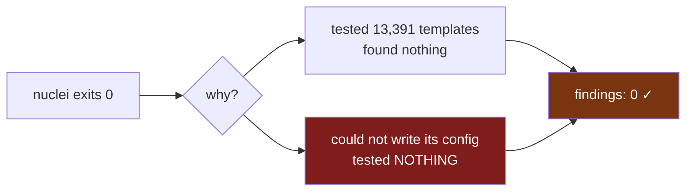
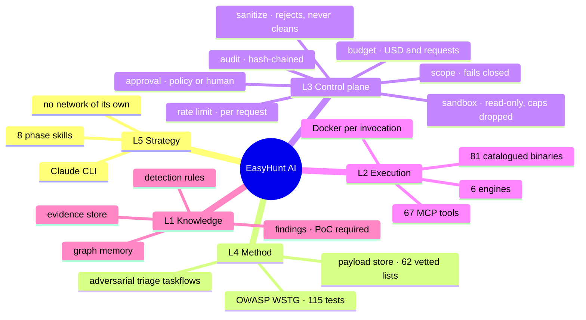
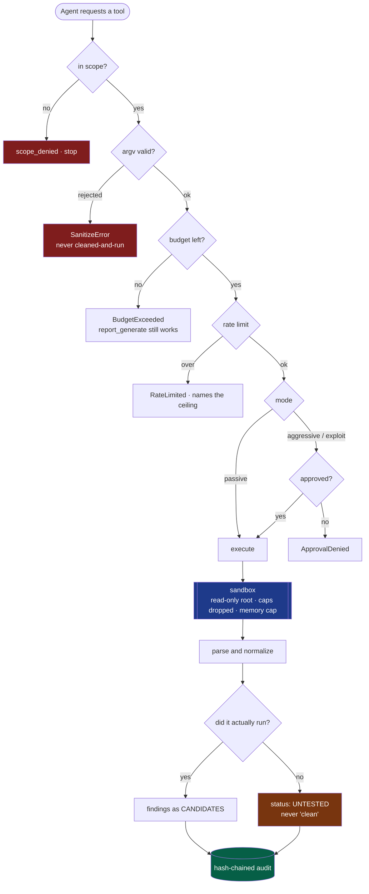
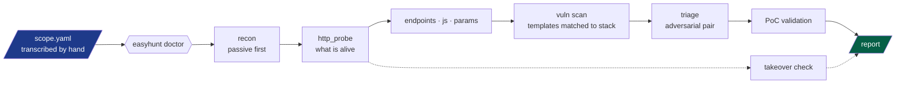

<div align="center">

# EasyHunt AI

**An agentic VAPT orchestrator where the control plane — not the model — is the security boundary.**

[](#development)
[](#every-tool-it-drives)
[](#mcp-tools-by-phase)
[](#tech-stack)
[](#isolation)
[](LICENSE)

</div>

> [!WARNING]
> **Authorized testing only.** Owned assets, an in-scope bug bounty program, or org
> assets with documented written approval. The `scope.yaml` you write **is** the
> authorization boundary, and the server refuses every request that falls outside
> it. This tool will not help you test something you have no permission to test.

---

## The one-paragraph version

Most AI security tools give a model a shell and a system prompt telling it to
behave. EasyHunt gives the model **no shell at all**. Every capability is an MCP
tool that passes through a fixed sequence — scope, sanitize, budget, rate-limit,
approval, sandbox, parse, audit — enforced in code, server-side, with no path
that skips a step. The model supplies strategy. The control plane decides what is
permitted. **A jailbroken prompt cannot reach the network.**

---

## Why this is not another scanner wrapper

Six design decisions, each of which came from something breaking in production.

### 1. Absence is not a clean result

This is the whole thing. A killed scan, a tool that could not write its config,
and a genuinely secure target all produce **zero findings** — and zero findings
reads as good news.



Both branches used to print the same result. Every wrapper now distinguishes
**tested and clean** from **not tested**, and says which in words:

> *"zero findings here means UNTESTED, not clean."*

Twenty-five instances of this defect have been found and fixed in this codebase
— including `nuclei` exiting **0** while unable to create its config directory,
and a command-injection tool that discarded its own target flag for the
project's entire life and reported "no injectable parameter" every time.

### 2. The scope file is an authorization record, not configuration

`scope.yaml` is transcribed by hand from the program's published policy. The
installer **refuses to create one for you** — it used to copy a template that
declared `authorization: bug-bounty` and a `fetched_at` date nobody had earned,
and three separate green ticks then confirmed it.

An absent scope is a correct state. A fabricated one is not.

### 3. Rate limits come from the program, never from a literal

The limiter charges per **request**, not per tool call — so a scanner with its
own thread pool cannot out-run the published ceiling while the audit log shows
one compliant call. Every rate flag is derived from `scope.rules`, then clamped
to what the binary actually accepts.

### 4. Tools are resolved by identity, not by PATH order

`pip install nuclei` gets you a 2018 Kaggle package. `slither` on PyPI is a
children's Scratch-for-Python toy. Kali's `medusa` is a password brute-forcer;
ours is a fuzzer. EasyHunt executes each candidate and keeps the one that
identifies itself — and never "fixes" a collision by uninstalling your software.

### 5. Health checks run where the tool runs

`easyhunt doctor` executes every tool **inside the container it will actually
run in**, under the real read-only root and dropped capabilities. Checking the
host copy answers a question about a different program — that is how tools
shipped broken for days behind a green tick.

### 6. No PoC, no finding

`Finding.confirm()` requires reproduction steps **and** an observed result. AI
triage may rank, downgrade and drop; a taskflow that declares a `confirm`
verdict is rejected at load time. Scanner output is a *candidate*, permanently,
until a human or a validator proves it.

---

## The whole system in one picture



## How one tool call flows



## Engagement flow



`scripts/hunt.sh` runs this unattended and **stops when a phase produces
nothing** — scanning hosts nobody confirmed alive is not a scan, it is a survey
of someone's WAF.

---

## Quick start

```bash
git clone https://github.com/iamsecure1920/EasyHunt-AI.git && cd EasyHunt-AI
./bootstrap.sh
```

That is the whole install. `bootstrap.sh` is idempotent and is also the repair
path: system packages, Go and Python runtimes, Docker enabled at boot, the
EasyHunt package, the tool suite, **the `easyhunt:latest` image**, the per-tool
images, then `easyhunt doctor`.

Budget **30–45 minutes** for a first run. Needs ~15 GB free and Python ≥ 3.11.

| Flag | Effect |
| --- | --- |
| `--no-build` | skip the image build (≈46 tools then run on the host) |
| `--no-images` | skip images entirely — no container isolation |
| `--no-tools` | package only |

> [!NOTE]
> `easyhunt:latest` is built from this repo's `Dockerfile` and is **not on any
> registry**, so `docker pull` cannot find it. `bootstrap.sh` builds it, or:
> `docker build -t easyhunt:latest .`

### Then, before anything touches a network

```bash
cp scope.example.yaml scope.yaml
$EDITOR scope.yaml          # transcribe the program's published policy
easyhunt scope validate
easyhunt doctor             # expect 0 broken
```

In Claude Code: `/easyhunt`.

### Running an engagement

```bash
# Unattended, all phases, gated
./scripts/hunt.sh target.example.com

# Several targets
./scripts/hunt.sh a.example.com b.example.com

# Pick phases, or resume
./scripts/hunt.sh target.example.com --only probe,scan
./scripts/hunt.sh target.example.com --from scan

# Exploitation — refused unless scope.yaml permits it
./scripts/hunt.sh target.example.com --exploit
```

Each phase appends to `status.jsonl` so a human or a model can watch without
touching the run:

```json
{"phase":"probe","state":"ok","tool":"http_probe","seconds":4.1,"produced":248,"findings":0}
{"phase":"cors","state":"failed","tool":"cors_audit","message":"killed at the timeout — UNTESTED, not clean"}
```

---

## Tech stack

| Layer | What it uses |
| --- | --- |
| Protocol | **MCP** via FastMCP 3.x — stdio and streamable-HTTP |
| Auth (remote) | **OAuth 2.1 + PKCE**, RFC 9728 / RFC 8707 |
| Language | **Python ≥ 3.11**, fully async; `uv` for installs |
| Isolation | **Docker** — read-only root, all capabilities dropped, memory/CPU caps, one writable mount |
| Models | **OpenRouter**, three tiers with price ceilings and fallbacks |
| Memory | JSONL findings store · optional **Neo4j** graph · cross-engagement PoC memory |
| Knowledge | **OWASP WSTG** — 115 tests, pinned, CC BY-SA · 62 vetted payload lists |
| Audit | Hash-chained JSONL — tampering breaks the chain |
| Code | ~26,200 lines · **1,288 tests** across 31 files · 83 install recipes |

## Isolation

Every containerised tool runs with:

```
--read-only              --cap-drop ALL         --security-opt no-new-privileges
--memory 2g --cpus 2.0   --network <per-tool>   one writable mount (the workspace)
```

Per-tool scratch mounts exist only where a tool genuinely needs `$HOME` — and
they mount the **leaf**, never the parent, because a tmpfs over a parent hides
the tool store and makes a dozen tools vanish.

---

## Every tool it drives

**67 MCP tools** over **81 catalogued binaries**.
`·` passive · `!` aggressive · `!!` exploit — the mode decides whether a human is consulted.

| Category | Binaries |
| --- | --- |
| **Recon** | `subfinder` `amass` `assetfinder` `findomain` `asnmap` `cdncheck` `theHarvester` `uncover` `shuffledns` `alterx` `subdominator` `subdomainsleuth` `bbot` `osmedeus` `whois` `dig` |
| **HTTP / TLS** | `httpx` `whatweb` `wafw00f` `tlsx` `testssl` `katana` `corscanner` `websocat` `graphql-cop` `jwt_tool` |
| **Content & params** | `ffuf` `feroxbuster` `dirsearch` `gobuster` `arjun` `paramspider` `gau` `waybackurls` `waymore` `linkfinder` `secretfinder` `xsstrike` `jsluice` `retire` `netsanitizer` |
| **Scanning** | `nuclei` `jaeles` `nikto` `wapiti` `semgrep` `nmap` `naabu` `masscan` `dnsx` |
| **Exploitation** | `sqlmap` `dalfox` `commix` `ssrfmap` `sstimap` `smuggler` `nosqli` `interactsh-client` `medusa` `strix` |
| **Takeover** | `subzy` `subjack` `dnsreaper` |
| **Secrets** | `trufflehog` `gitleaks` `noseyparker` `kingfisher` `gitdorker` |
| **Cloud** | `prowler` `cloudfox` `kubescape` `s3scanner` `cloud_enum` `cloudpeass` |
| **Smart contracts** | `slither` `aderyn` `forge` |
| **LLM security** | `garak` `promptfoo` `deepteam` |

Run `easyhunt doctor` for the live picture.

### MCP tools by phase

| Phase | Tools |
| --- | --- |
| **Recon** | `subdomain_enum` `asn_lookup` `whois_lookup` `tls_info` `bbot_scan` `bbot_scan_active`! `osmedeus_flow`! |
| **DNS** | `dns_resolve` `cdn_check` `dns_permute`! |
| **HTTP** | `http_probe` `waf_detect` `tls_audit` `cors_audit` |
| **Endpoints** | `endpoint_discovery` `content_discovery`! `param_discovery`! `graphql_audit` `websocket_probe` `payload_catalog` |
| **JavaScript** | `js_analyze` |
| **Ports** | `port_scan`! `service_scan`! |
| **Takeover** | `takeover_detect`! `takeover_verify` `takeover_poc_plan` `takeover_confirm`!! |
| **Vuln scan** | `nuclei_scan`! `jaeles_scan`! `nikto_scan`! `wapiti_scan`! `semgrep_scan` |
| **Exploit** | `sqli_validate`!! `xss_validate`!! `ssrf_probe`!! `ssti_probe`!! `cmdi_probe`!! `nosqli_probe`!! `smuggling_probe`!! `strix_deep`!! `oob_listener`! `validate_findings`!! `poc_record` |
| **Secrets** | `secret_scan` `secret_validate`! `jwt_inspect` `source_fetch` |
| **Cloud** | `cloud_audit`! `cloud_asset_discovery`! `cloud_attack_paths`! `cloud_permissions`! `k8s_posture`! |
| **Contracts** | `contract_static_scan` `contract_toolchain` |
| **LLM** | `llm_redteam`! `llm_scan_config`! `llm_probe_catalog` |
| **Method** | `wstg_lookup` `hunt_plan` |
| **Triage** | `triage_findings` `triage_taskflows` `triage_canary_preview` |
| **Report** | `report_generate` `findings_list` `finding_detail` `finding_note` |
| **Control** | `job_status` |

---

## Architecture

```
L5  STRATEGY   Claude CLI — plans and decides. No network access of its own.
L4  METHOD     8 Claude Skills, one per VAPT phase.
L3  CONTROL    MCP server — scope, sanitize, rate-limit, approve, sandbox, audit.
L2  EXECUTION  6 engines (BBOT · Nuclei · Jaeles · Semgrep · Osmedeus · Strix)
               + 66 atomic wrappers, each sandboxed.
L1  KNOWLEDGE  Rule packs · task graph · findings store · evidence · PoC memory.

               LLM traffic ──▶ OpenRouter (3 tiers, fallbacks, price ceilings)
```

**Engines over wrappers.** BBOT already orchestrates 80+ recon modules, so
EasyHunt drives it through its Python API rather than wrapping each one. Atomic
wrappers exist where surgical control matters.

**Scope is enforced twice.** BBOT's own allow/deny lists are populated from
`scope.yaml`, *and* every emitted event is re-checked before storage — a module
that resolves outward cannot smuggle a host into the findings store.

Module-level walk-through: [`docs/ARCHITECTURE.md`](docs/ARCHITECTURE.md).

---

## Extending it

Drop a YAML file into `rules/` and you have a new detection. No code change.

| Directory | Format | Run by |
| --- | --- | --- |
| `rules/nuclei/` | Nuclei templates + workflows | Nuclei engine |
| `rules/easyhunt/` | native matcher/extractor packs | built-in matcher |
| `rules/jaeles/`, `rules/semgrep/`, `rules/bbot/` | those tools' native formats | their engines |

A Python plugin gets the same treatment as a built-in tool: it is wrapped by the
same decorator and passes through the same eight steps. There is no privileged
path.

---

## Safety properties worth knowing

- **The model never holds a shell.** It calls MCP tools; the server executes.
- **Denylist beats allowlist**, always, and unparseable input fails closed.
- **Arguments are rejected, never sanitized-and-run** — a caller that quietly
  strips a semicolon teaches the agent that malformed input sometimes works.
- **No evasion capability, ever.** `--random-agent`, `--tor`, proxy chaining and
  their equivalents are globally denied. Not configurable.
- **Aggressive and exploit modes are gated**, and exploitation is additionally
  refused when the engagement's rules disallow it.
- **The audit log is hash-chained.** Editing an entry breaks verification.

---


## Cost control

Three tiers, configured in `config.yaml`, never hardcoded:

- **T0** — dedupe, classify, bulk-summarize recon.
- **T1** — correlation, candidate ranking, false-positive triage.
- **T2** — exploit reasoning and the final report.

With `models[]` fallbacks (billed only for the one that runs, `openrouter/auto`
last so a renamed slug degrades instead of failing), a `max_price` ceiling per
tier, per-phase token budgets, and rate-limit demotion to a cheaper tier rather
than failing a phase.

Raw tool output never reaches a model. It is parsed, deduplicated, and filtered
in code first, then map-reduced on the cheap tier. **Everything except AI triage
and report synthesis works with no API key at all.**

---

---

## Remote access (OAuth 2.1 + PKCE)

`stdio` — the normal Claude CLI setup — is a pipe to the parent process and needs
no auth. The remote transport is different: a network-reachable EasyHunt runs
scanners and exploitation tools on request, so **binding a non-loopback address
without auth is refused outright**, not warned about.

```yaml
auth:
  mode: jwt                                # or oauth_proxy
  base_url: https://easyhunt.internal.example.com
  jwks_uri: https://idp.example.com/.well-known/jwks.json
  issuer: https://idp.example.com/
  authorization_servers: [https://idp.example.com]
```

EasyHunt acts as an OAuth 2.1 **Resource Server**: it publishes RFC 9728
protected-resource metadata, answers unauthenticated calls with
`WWW-Authenticate: Bearer resource_metadata="…"`, and verifies bearer tokens
against your IdP. PKCE is `S256`-only — the MCP SDK types the challenge method as
`Literal["S256"]`, so `plain` cannot be negotiated. Tokens are audience-bound to
`base_url` (RFC 8707), so one minted for another service that trusts the same IdP
is rejected here.

**Scopes map onto EasyHunt's risk tiers**, which is where this earns its keep:

| Scope | Unlocks |
| --- | --- |
| `easyhunt:read` | status, findings, scope checks — no target contact |
| `easyhunt:recon` | passive tools |
| `easyhunt:scan` | aggressive tools (ports, nuclei, brute force) |
| `easyhunt:exploit` | exploit tools (PoC validation, takeover confirmation) |
| `easyhunt:approve` | answering approval prompts |
| `easyhunt:admin` | loading a scope, reloading rules |

A token is a **ceiling**, checked before the human approval gate rather than
instead of it — a CI token holding only `easyhunt:recon` cannot invoke
exploitation even if a human would have approved it. Scope filtering applies to
discovery as well as invocation, so an unauthenticated caller cannot even
enumerate the tooling.

`easyhunt:approve` is deliberately separate from every operational scope. **If the
agent's token could satisfy it, the agent could answer its own approval prompts
and human-in-the-loop would be decorative.** Issue it to an operator's token and
nothing else.

For an IdP without Dynamic Client Registration (GitHub, Google), use
`mode: oauth_proxy`; FastMCP fronts it and forwards PKCE and the resource
indicator upstream. Credentials come from the environment, never `config.yaml`.

---

## Reasoning across an engagement

**Attack paths.** `cloud_attack_paths` turns posture findings into reachability:
which internet-facing entry point reaches which valuable resource, in how many
hops. Paths are ranked by what the destination is worth against how exposed the
entry is — a two-hop path to customer data outranks a one-hop path to an empty
dev bucket. With Cartography + Neo4j the edges are *observed*; without it they
are inferred from control failures and labelled as such.

**Graph memory.** Every asset, finding, and relationship is indexed as the run
proceeds, so `graph_recall("api.example.com")` answers "what do I already know
about this host" without a re-scan. Native by default — Neo4j is optional and
only adds cross-engagement persistence. Stores the index, never the loot.

**Rendered graphs.** Reports get `taskgraph.svg` and `attack-paths.svg` (plus
`.dot`, and `.png` when a converter is installed). SVG is generated by a
dependency-free layered-DAG layout, because a report artifact that only exists
when Graphviz happens to be installed is one you cannot rely on.

**Prompt caching.** Stable instructions carry an explicit `cache_control`
breakpoint with volatile data after them, so a triage phase pays for its rubric
once instead of twenty times. Cached tokens and the resulting savings are
recorded per call in the audit log.

---

---

## Layout

```
easyhunt/
  control_plane/   scope · sanitize · budget · ratelimit · approval
                   · sandbox · audit · auth · jobs · pins · context
  tools/           66 wrappers, one decorator, no privileged path
  engines/         bbot · nuclei · jaeles · semgrep · osmedeus · strix
  knowledge/       findings · WSTG · payloads · graph memory
  install/         83 recipes, identity-verified
  llm/             OpenRouter routing, 3 tiers
skills/            8 phase playbooks for the agent
rules/             detection packs — YAML, no code
scripts/           hunt.sh · phase.py · summary.py · lab_target.py
docs/              architecture · bootstrap · payloads
```

## Development

```bash
.venv/bin/python -m pytest tests/ -q          # 1,288 tests
.venv/bin/ruff check easyhunt/ tests/
easyhunt doctor                                # executed, not just found on PATH
```

Nearly every test in the suite exists because something broke against a live
target. That is the working loop: run it against something real, distrust every
clean result, verify hits by hand, fix the class rather than the instance, encode
the bug in a test, then re-measure.

## License

See [LICENSE](LICENSE). Third-party tools retain their own licenses — several are
AGPL-3.0, and `nmap` ships under a custom non-OSI license. `easyhunt doctor`
prints the license of every tool it finds.
