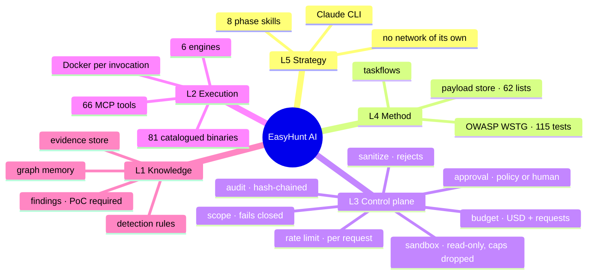
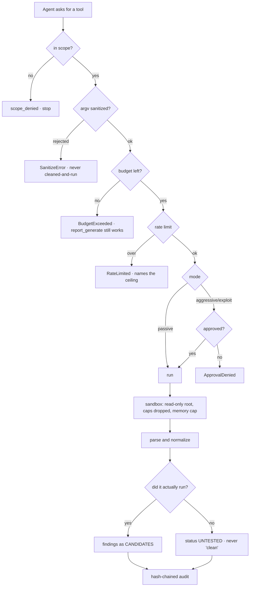
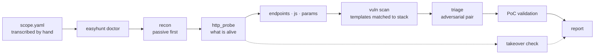

# EasyHunt AI

Agentic VAPT orchestrator. Drives open-source security engines through a custom
MCP server, runs inside the Claude CLI, and routes model traffic through
OpenRouter.

> **Authorized testing only.** Owned assets, an in-scope bug bounty program, or
> org assets with documented written approval. The `scope.yaml` you write *is*
> the authorization boundary, and the server refuses every request that falls
> outside it.

---

## What it actually is

A **control plane** that sits between an AI agent and 81 catalogued security tools. The
agent plans; the control plane decides what is permitted. Every capability —
engine, wrapper, or user-supplied plugin — passes through one fixed sequence:

```
scope → sanitize → budget → rate-limit → approval → sandbox exec
      → parse/normalize → audit → structured return
```

There is no flag, argument, or debug mode that skips a step. That is the whole
design: adding the fiftieth tool cannot accidentally add the first unguarded one.

### The five rules it enforces in code

| Rule | Where it lives |
| --- | --- |
| Denylist beats allowlist; unparseable input fails closed | `control_plane/scope.py` |
| Arguments are **rejected**, never sanitized-and-run | `control_plane/sanitize.py` |
| Aggressive and exploit actions stop for a human | `control_plane/approval.py` |
| **No PoC, no finding** — only a reproducible proof confirms | `knowledge/findings.py` |
| No scope, rate-limit, or attribution evasion capability, ever | `sanitize.GLOBAL_DENIED_FLAGS` |

The fourth is worth spelling out: `Finding.confirm()` requires a PoC with both
reproduction steps and an observed result. AI triage can rank, downgrade, and
drop — a taskflow that declares a `confirm` verdict is rejected at load time.

---

## The whole thing in one picture



## How one tool call actually flows

Every capability takes this path. There is no flag, debug mode or plugin hook
that skips a step — that is the property the whole design exists to hold.



The `K` branch is the one that took the longest to get right. A killed scan, a
tool that could not write its config, a WAF page returning 200 — all of them
produce *zero findings*, and zero findings reads as good news. Every wrapper
distinguishes **tested and clean** from **not tested**, and says which in words.

## Engagement flow



`scripts/hunt.sh` runs this unattended, one phase at a time, and **stops when a
phase produces nothing** — scanning hosts nobody confirmed alive is not a scan.

---

## Tech stack

| Layer | What it uses |
| --- | --- |
| Protocol | **MCP** via FastMCP 3.x — stdio and streamable-HTTP |
| Auth (remote) | **OAuth 2.1 + PKCE**, RFC 9728 / RFC 8707 |
| Language | **Python ≥ 3.11**, fully async, `uv` for installs |
| Isolation | **Docker** — read-only root, all capabilities dropped, memory/CPU caps, one writable mount |
| Models | **OpenRouter**, three tiers with price ceilings and fallbacks |
| Memory | JSONL findings store, optional **Neo4j** graph, cross-engagement PoC memory |
| Knowledge | **OWASP WSTG** (115 tests, pinned, CC BY-SA), vetted payload store |
| Audit | Hash-chained JSONL — tampering breaks the chain |
| Tests | **1,266** covering the control plane, wrappers and regressions |

## Integrated tools

**66 MCP tools** driving **81 catalogued binaries**. `·` passive, `!` aggressive,
`!!` exploit — the mode decides whether a human is consulted.

| Category | Binaries |
| --- | --- |
| **Recon** | `subfinder` `amass` `assetfinder` `findomain` `asnmap` `cdncheck` `theHarvester` `uncover` `shuffledns` `alterx` `subdominator` `subdomainsleuth` `bbot` `osmedeus` `whois` `dig` |
| **HTTP / TLS** | `httpx` `whatweb` `wafw00f` `tlsx` `testssl` `katana` `corscanner` `websocat` `graphql-cop` `jwt_tool` |
| **Content & params** | `ffuf` `feroxbuster` `dirsearch` `gobuster` `arjun` `paramspider` `gau` `waybackurls` `waymore` `linkfinder` `secretfinder` `xsstrike` `jsluice` `retire` `netsanitizer` |
| **Scanning** | `nuclei` `jaeles` `nikto` `wapiti` `semgrep` `nmap` `naabu` `masscan` `dnsx` |
| **Exploitation** | `sqlmap` `dalfox` `commix` `ssrfmap` `sstimap` `smuggler` `nosqli` `interactsh-client` `medusa` `strix` |
| **Takeover** | `subzy` `subjack` `dnsreaper` |
| **Secrets** | `trufflehog` `gitleaks` `noseyparker` `kingfisher` `gitdorker` |
| **Cloud** | `prowler` `cloudfox` `kubescape` `s3scanner` `cloud_enum` `cloudpeass` |
| **Smart contracts** | `slither` `aderyn` `forge` |
| **LLM security** | `garak` `promptfoo` `deepteam` |

Run `easyhunt doctor` for the live picture — it executes each tool **inside the
container it will actually run in**, so a green tick is a claim about the program
that runs, not about a filename on your PATH.

### MCP tools by phase

| Phase | Tools |
| --- | --- |
| Recon | `subdomain_enum` `asn_lookup` `whois_lookup` `tls_info` `bbot_scan` `bbot_scan_active`! `osmedeus_flow`! |
| DNS | `dns_resolve` `cdn_check` `dns_permute`! |
| HTTP | `http_probe` `waf_detect` `tls_audit` `cors_audit` |
| Endpoints | `endpoint_discovery` `content_discovery`! `param_discovery`! `graphql_audit` `websocket_probe` `payload_catalog` |
| JS | `js_analyze` |
| Ports | `port_scan`! `service_scan`! |
| Takeover | `takeover_detect`! `takeover_verify` `takeover_poc_plan` `takeover_confirm`!! |
| Vuln scan | `nuclei_scan`! `jaeles_scan`! `nikto_scan`! `wapiti_scan`! `semgrep_scan` |
| Exploit | `sqli_validate`!! `xss_validate`!! `ssrf_probe`!! `ssti_probe`!! `cmdi_probe`!! `nosqli_probe`!! `smuggling_probe`!! `strix_deep`!! `oob_listener`! `validate_findings`!! `poc_record` |
| Secrets | `secret_scan` `secret_validate`! `jwt_inspect` `source_fetch` |
| Cloud | `cloud_audit`! `cloud_asset_discovery`! `cloud_attack_paths`! `cloud_permissions`! `k8s_posture`! |
| Contracts | `contract_static_scan` `contract_toolchain` |
| LLM | `llm_redteam`! `llm_scan_config`! `llm_probe_catalog` |
| Method | `wstg_lookup` |
| Triage | `triage_findings` `triage_taskflows` `triage_canary_preview` |
| Report | `report_generate` `findings_list` `finding_detail` `finding_note` |
| Control | `job_status` |


## Quick start — a machine with nothing on it

```bash
git clone https://github.com/iamsecure1920/EasyHunt-AI.git && cd EasyHunt-AI
./bootstrap.sh
```

That is the whole install. `bootstrap.sh` is idempotent, safe to re-run, and is
also the repair path — it installs system packages, Go and Python runtimes,
Docker (enabled at boot), the EasyHunt package, the tool suite, **builds the
`easyhunt:latest` container image**, pulls the per-tool images, and then runs
`easyhunt doctor` and prints what is still missing.

Budget **30–45 minutes** for the first run; almost all of it is the image build.
Needs ~30 GB free, Python ≥ 3.11, and **Go ≥ 1.21** — Debian's `golang-go` is
1.19 and every Go tool refuses to build against it. `bootstrap.sh` detects this
and installs a current toolchain from go.dev.

| Flag | Effect |
| --- | --- |
| `--no-build` | skip the `easyhunt:latest` build (73 tools then run on the host) |
| `--no-images` | skip images entirely — no container isolation |
| `--no-tools` | package only |

### Why the image matters

`easyhunt:latest` is built from the `Dockerfile` in this repo and is **not on any
registry**, so `docker pull` cannot find it — `bootstrap.sh` builds it, or you
can do it yourself:

```bash
docker build -t easyhunt:latest .
```

46 of the 81 catalogued tools live in it, and 48 have a container home once the
per-tool images are counted. Without it, every one of those falls back to the
host: no read-only root, no dropped capabilities, no memory ceiling — and on a
fresh machine, mostly not installed at all. `easyhunt doctor` tells you which is
which: a working tool prints `@image`, and one with no marker ran on the host.

### Manual install, if you prefer

```bash
./install.sh                    # package, skills, MCP registration
easyhunt install                # the ~20-tool core pipeline
easyhunt install --all          # all 81, including cloud and LLM red-team
docker build -t easyhunt:latest .
```

`easyhunt install` is idempotent, dependency-ordered, and **verifies every tool
after installing it** — a successful `go install` does not mean a working tool.
It reports per-tool failures with the command and stderr and keeps going, so one
broken recipe costs you one tool rather than the run.

```bash
easyhunt install --dry-run      # show the plan, change nothing
easyhunt install --category dns # one group at a time
easyhunt doctor --fix           # repair what is already here
```

It never installs into EasyHunt's own environment — Python tools go through
`pipx`, isolated. That is enforced with a guard, after `pip install semgrep` once
pulled in `fastmcp-slim` and silently broke the application's MCP client.

### Configuration

`config.yaml` is gitignored — it holds your own choices. Until you write one,
EasyHunt reads `config.example.yaml`, which carries the shipped posture: sandbox
on, the image map, and the per-tool scratch mounts that several tools need to
start at all. Copy it when you want to change something:

```bash
cp config.example.yaml config.yaml
```

Then, before anything else:

```bash
cp scope.example.yaml scope.yaml
$EDITOR scope.yaml              # fill in from the program's policy page
easyhunt doctor                 # what is installed, configured, and missing
easyhunt scope example.com      # confirm a target resolves the way you expect
```

> **The installer will not do this for you, deliberately.** `install.sh` used to
> copy the template into place; the operator ended up with a file declaring
> `authorization: bug-bounty`, a `program_url` and a `fetched_at` date they never
> wrote — and `easyhunt doctor` then printed a green tick for it. `scope.yaml` is
> not configuration, it is the record of an authorization. `easyhunt scope
> validate` warns if it is still the unedited template.


In Claude Code: `/easyhunt`.

### What "installed" means here

`doctor` and the installer both resolve tools **by identity, not PATH order**.
`httpx` is both ProjectDiscovery's prober and the Python HTTP library's CLI; if
the wrong one is first on your PATH it exits zero, prints nothing, and looks
exactly like a target with no live hosts. EasyHunt runs each candidate once and
picks the one that identifies itself, so a shadowed install is reported and used
correctly rather than silently producing empty scans.

---

## Architecture

See the diagrams above, and `docs/ARCHITECTURE.md` for the module-level walk-through.

**Engines over wrappers.** BBOT already orchestrates 80+ recon modules, so EasyHunt
drives it through its Python API rather than wrapping each one. Atomic wrappers
exist where surgical control matters.

**Scope is enforced twice.** BBOT's own whitelist/blacklist are populated from
`scope.yaml`, *and* every emitted event is re-checked before storage — a module
that resolves outward cannot smuggle a host into the findings store.


## Extending it

Drop a YAML file into `rules/` and you have a new detection. No code change.

| Directory | Format | Run by |
| --- | --- | --- |
| `rules/nuclei/` | Nuclei templates + workflows | Nuclei engine |
| `rules/easyhunt/` | native matcher/extractor packs | built-in matcher engine |
| `rules/jaeles/`, `rules/semgrep/` | those tools' native formats | their engines |
| `rules/bbot/` | BBOT presets | BBOT |
| `rules/easyhunt/*.py` + manifest | Python plugin | the EasyHunt runner |

Every rule must declare a `verify` block saying how a hit gets confirmed, and a
Python plugin claiming `mode: passive` while its source reaches for an aggressive
primitive is **refused at load time** — that check exists so the approval gate
cannot be bypassed by mislabeling.

```bash
easyhunt rules          # what loaded, and what was rejected and why
```

A rejected rule is a detection you think you have and don't, so `rules_list()`
surfaces rejections to the agent too.

---

## Cost control

Three tiers, configured in `config.yaml`, never hardcoded:

- **T0** — dedupe, classify, bulk-summarize recon.
- **T1** — correlation, candidate ranking, false-positive triage.
- **T2** — exploit reasoning and the final report.

With `models[]` fallbacks (billed only for the one that runs, `openrouter/auto`
last so a renamed slug degrades instead of failing), a `max_price` ceiling per
tier, per-phase token budgets, and rate-limit demotion to a cheaper tier rather
than failing a phase.

Raw tool output never reaches a model. It is parsed, deduplicated, and filtered
in code first, then map-reduced on the cheap tier. **Everything except AI triage
and report synthesis works with no API key at all.**

---

## Remote access (OAuth 2.1 + PKCE)

`stdio` — the normal Claude CLI setup — is a pipe to the parent process and needs
no auth. The remote transport is different: a network-reachable EasyHunt runs
scanners and exploitation tools on request, so **binding a non-loopback address
without auth is refused outright**, not warned about.

```yaml
auth:
  mode: jwt                                # or oauth_proxy
  base_url: https://easyhunt.internal.example.com
  jwks_uri: https://idp.example.com/.well-known/jwks.json
  issuer: https://idp.example.com/
  authorization_servers: [https://idp.example.com]
```

EasyHunt acts as an OAuth 2.1 **Resource Server**: it publishes RFC 9728
protected-resource metadata, answers unauthenticated calls with
`WWW-Authenticate: Bearer resource_metadata="…"`, and verifies bearer tokens
against your IdP. PKCE is `S256`-only — the MCP SDK types the challenge method as
`Literal["S256"]`, so `plain` cannot be negotiated. Tokens are audience-bound to
`base_url` (RFC 8707), so one minted for another service that trusts the same IdP
is rejected here.

**Scopes map onto EasyHunt's risk tiers**, which is where this earns its keep:

| Scope | Unlocks |
| --- | --- |
| `easyhunt:read` | status, findings, scope checks — no target contact |
| `easyhunt:recon` | passive tools |
| `easyhunt:scan` | aggressive tools (ports, nuclei, brute force) |
| `easyhunt:exploit` | exploit tools (PoC validation, takeover confirmation) |
| `easyhunt:approve` | answering approval prompts |
| `easyhunt:admin` | loading a scope, reloading rules |

A token is a **ceiling**, checked before the human approval gate rather than
instead of it — a CI token holding only `easyhunt:recon` cannot invoke
exploitation even if a human would have approved it. Scope filtering applies to
discovery as well as invocation, so an unauthenticated caller cannot even
enumerate the tooling.

`easyhunt:approve` is deliberately separate from every operational scope. **If the
agent's token could satisfy it, the agent could answer its own approval prompts
and human-in-the-loop would be decorative.** Issue it to an operator's token and
nothing else.

For an IdP without Dynamic Client Registration (GitHub, Google), use
`mode: oauth_proxy`; FastMCP fronts it and forwards PKCE and the resource
indicator upstream. Credentials come from the environment, never `config.yaml`.

## Safety properties worth knowing

- **Audit log is hash-chained.** Every attempt — including refusals — is one
  JSONL line carrying the previous line's digest. Deletions and edits are
  detectable. Credential-shaped values are redacted on the way in.
- **Tool output is treated as untrusted input.** Prompt-injection markers in
  target-controlled text are stripped before it reaches a context window, with a
  visible `[stripped: ...]` marker left behind.
- **Tool definitions are cryptographically pinned.** A passive tool that becomes
  an exploit tool between runs is reported as a privilege escalation.
- **Budget ceilings abort cleanly.** Report generation is deliberately exempt
  from the spend gate, so a stopped run still produces a report — labelled
  PARTIAL on its first page.
- **Canary defense in triage.** Fabricated findings on `.invalid` hosts are mixed
  into every batch; a pass that "confirms" one has its verdicts weighted down,
  and the measurement is reported.

## Reasoning across an engagement

**Attack paths.** `cloud_attack_paths` turns posture findings into reachability:
which internet-facing entry point reaches which valuable resource, in how many
hops. Paths are ranked by what the destination is worth against how exposed the
entry is — a two-hop path to customer data outranks a one-hop path to an empty
dev bucket. With Cartography + Neo4j the edges are *observed*; without it they
are inferred from control failures and labelled as such.

**Graph memory.** Every asset, finding, and relationship is indexed as the run
proceeds, so `graph_recall("api.example.com")` answers "what do I already know
about this host" without a re-scan. Native by default — Neo4j is optional and
only adds cross-engagement persistence. Stores the index, never the loot.

**Rendered graphs.** Reports get `taskgraph.svg` and `attack-paths.svg` (plus
`.dot`, and `.png` when a converter is installed). SVG is generated by a
dependency-free layered-DAG layout, because a report artifact that only exists
when Graphviz happens to be installed is one you cannot rely on.

**Prompt caching.** Stable instructions carry an explicit `cache_control`
breakpoint with volatile data after them, so a triage phase pays for its rubric
once instead of twenty times. Cached tokens and the resulting savings are
recorded per call in the audit log.

---

## Layout

```
easyhunt/
├── mcp_server.py          MCP entrypoint — the only door
├── control_plane/         scope · sanitize · ratelimit · approval
│                          sandbox · audit · budget · jobs · pins
├── engines/               bbot · nuclei · osmedeus · strix
├── tools/                 base.py (the decorator) + wrappers by phase
├── plugins/               manifest schema · loader · matcher engine
├── knowledge/             findings · taskgraph · memory
├── llm/                   openrouter · summarize · triage
└── report/                synthesize.py
rules/ · taskflows/ · skills/ · tests/
docs/ · scripts/ · CLAUDE.md · bootstrap.sh
```

## Documentation

`CLAUDE.md` is loaded automatically by Claude CLI and carries the hard
invariants — read it first. Full index in [`docs/README.md`](docs/README.md).

| Document | Answers |
|---|---|
| [`CLAUDE.md`](CLAUDE.md) | The invariants, working rhythm, and known traps. |
| [`docs/ARCHITECTURE.md`](docs/ARCHITECTURE.md) | Mind map, control-plane sequence, engagement flow, module map. |
| [`docs/BOOTSTRAP.md`](docs/BOOTSTRAP.md) | New-machine setup and troubleshooting. |
| [`docs/PAYLOADS.md`](docs/PAYLOADS.md) | Vetted payload store: tiers, quarantine, tool mapping. |

New machine? `./bootstrap.sh` — idempotent, safe to re-run.

## Development

```bash
.venv/bin/python -m pytest tests/ -q          # 1,266 tests
.venv/bin/python -m pytest tests/test_security.py -q   # adversarial suite
.venv/bin/ruff check easyhunt/ tests/
```

`tests/test_security.py` tries to defeat each control — scope bypass via
homoglyphs, IP encodings and list smuggling; sanitizer fuzzing; approval bypass;
prompt injection; tool-definition tampering. `tests/test_e2e.py` runs the full
pipeline against a deliberately misconfigured server it starts on loopback.

## License

MIT. Note that several wrapped tools carry stronger licenses — TruffleHog and
masscan are AGPL-3.0, nmap is NPSL. Each tool's license is recorded in its
`ToolSpec` and printed in the report's tool inventory, which matters the moment
anyone redistributes a bundle.
