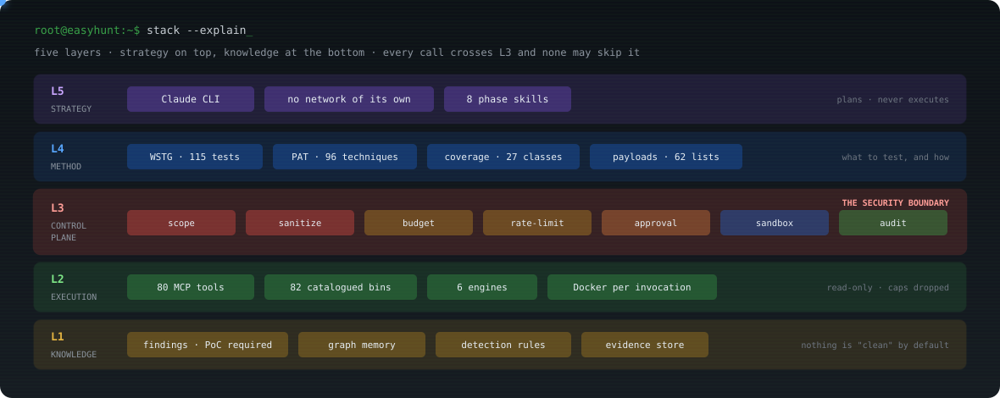
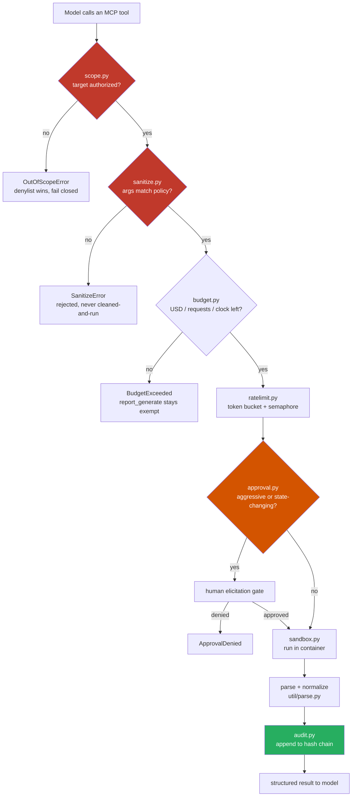
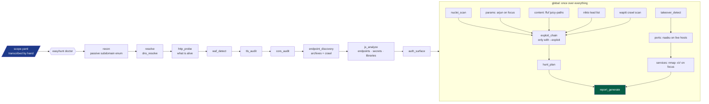

# EasyHunt AI — Complete User Manual

> **EasyHunt AI** is an agentic VAPT (Vulnerability Assessment and Penetration
> Testing) orchestrator. It drives **80 MCP tools over 82 catalogued open-source
> security binaries** behind a mandatory, server-side control plane. The AI model
> supplies *strategy*; the MCP server decides *what is permitted* and enforces it
> in code; the sandboxed engines do the work. **The model never holds a shell.**

This document is the complete reference: what is installed, what must be
installed, how every script and module is interlinked, how they stay in sync,
the full flow in pictures, configuration, operation, safety, and troubleshooting.

---

## Table of contents

1. [What this tool is](#1-what-this-tool-is)
2. [Prerequisites](#2-prerequisites)
3. [Installation](#3-installation)
4. [Configuration files](#4-configuration-files)
5. [The whole system in one picture](#5-the-whole-system-in-one-picture)
6. [How one tool call flows (control-plane sequence)](#6-how-one-tool-call-flows-control-plane-sequence)
7. [The engagement pipeline (the unattended flow)](#7-the-engagement-pipeline-the-unattended-flow)
8. [How every script and module is interlinked](#8-how-every-script-and-module-is-interlinked)
9. [How the scripts stay in sync](#9-how-the-scripts-stay-in-sync)
10. [Every tool it drives](#10-every-tool-it-drives)
11. [MCP tools by phase](#11-mcp-tools-by-phase)
12. [Knowledge layer (WSTG, PAT, coverage, payloads)](#12-knowledge-layer-wstg-pat-coverage-payloads)
13. [Running an engagement](#13-running-an-engagement)
14. [Exploitation and the auto-chain](#14-exploitation-and-the-auto-chain)
15. [Remote access (OAuth 2.1 + PKCE)](#15-remote-access-oauth-21--pkce)
16. [Safety properties](#16-safety-properties)
17. [Troubleshooting](#17-troubleshooting)
18. [Development and testing](#18-development-and-testing)
19. [File and directory layout](#19-file-and-directory-layout)

---

## 1. What this tool is

Most "AI security tools" hand a model a shell and a system prompt telling it to
behave. EasyHunt gives the model **no shell at all**. Every capability is an MCP
tool that passes through a fixed, non-bypassable sequence:

```
scope → sanitize → budget → rate-limit → approval → sandbox → parse → audit
```

That sequence is enforced **server-side, in code**, with no path that skips a
step. A jailbroken or prompt-injected model cannot reach the network.

What it does, concretely:

- **Reconnaissance** — subdomain enumeration, ASN/whois, DNS resolution, CDN/WAF
  detection, HTTP probing, technology fingerprinting.
- **Attack-surface mapping** — URL/endpoint discovery from archives and crawling,
  JavaScript bundle analysis (endpoints + secrets + vulnerable libraries),
  parameter discovery, content/API fuzzing.
- **Scanning** — nuclei, jaeles, nikto, wapiti, semgrep, port/service scanning.
- **Exploitation (gated)** — SQLi (sqlmap), XSS (dalfox), SSTI, NoSQLi, command
  injection, request smuggling, open redirect/CRLF/LFI/XXE/HPP, subdomain
  takeover, SSRF.
- **Validation** — every scanner hit is a *candidate* until a reproducible proof
  of concept confirms it.
- **Reporting** — a submittable Markdown/CSV/JSON report with scope, methodology,
  tool inventory, cost, and a hash-chained audit trail.

The whole point, in one sentence: **absence of a finding is never silently
reported as a clean result.** A killed scan, a tool that could not write its
config, and a genuinely secure target all produce zero findings — EasyHunt
distinguishes "tested and clean" from "not tested", in words, every time.

---

## 2. Prerequisites

### Operating system

| OS | Support |
|---|---|
| Ubuntu 22.04 / 24.04 LTS | ✅ fully supported |
| Debian 11 / 12 | ✅ supported |
| Kali Linux 2024+ | ✅ supported |
| macOS 13+ | ⚠️ partial (some tools are Linux-only) |
| Windows | ❌ use WSL2 with Ubuntu 22.04 |

`bootstrap.sh` uses `apt-get`; other distros need the §3 system packages
installed manually.

### Hardware

| Resource | Minimum | Recommended |
|---|---|---|
| Disk | 15 GB free | 30 GB+ (sandbox images ~7 GB, tool suite ~3 GB, artifacts grow) |
| RAM | 4 GB | 8 GB+ (bbot and nuclei are memory-hungry at concurrency) |
| CPU | 2 cores | 4+ |
| Network | outbound 443 | — |

### Runtimes

| Runtime | Version | Used by |
|---|---|---|
| Python | ≥ 3.11 | the control plane and ~14 tools |
| Go | ≥ 1.21 (1.25 for httpx) | ~28 tools |
| Rust + cargo | latest | findomain, feroxbuster, noseyparker, kingfisher |
| Node.js | ≥ 20.20.0 | retire, promptfoo |
| Ruby | ≥ 2.7 | whatweb |

### Privileges

`root` or `sudo`. Docker, apt, and raw-socket tools (naabu/nmap/masscan) need it.

### Required API keys (optional, by feature)

| Key | Enables |
|---|---|
| `$OPENROUTER_API_KEY` | AI triage + narrative report synthesis (everything else works without it) |
| Subfinder/Amass/theHarvester keys | richer subdomain enumeration (public sources still work) |
| AWS / GCP / Azure credentials | cloud posture tools (prowler, cloudfox, etc.) |

**`$OPENROUTER_API_KEY` is the only key the tool itself reads.** Everything
else lives in the respective tool's own config (`~/.config/subfinder/…`,
`~/.config/amass/datasources.yaml`, `api-keys.yaml`, cloud env vars).

---

## 3. Installation

### One command

```bash
git clone https://github.com/iamsecure1920/EasyHunt-AI.git && cd EasyHunt-AI
./bootstrap.sh
```

`bootstrap.sh` is **idempotent** and is also the repair path. Budget 30–45
minutes for a first run.

### What `bootstrap.sh` does, in order

1. **Disk check** — warns under 30 GB, refuses to pull images under 15 GB.
2. **System packages** — `build-essential`, `libpcap-dev`, `git`, `curl`, `jq`,
   `python3-venv`, `pipx`, `golang-go`. (`libpcap-dev` is required for raw
   sockets; `build-essential` for katana headless CGO support.)
3. **PATH ordering** — appends `~/.local/bin`, `/usr/local/bin`, `$GOPATH/bin`
   to `~/.profile`.
4. **Docker** — installs, unmasks (Kali ships it masked), enables, starts.
5. **`install.sh`** — Python package, tool suite, nuclei templates, skills, MCP
   registration.
6. **FastMCP guard** — verifies `import fastmcp`, force-reinstalls the pinned
   version if a transitive `fastmcp-slim` displaced it.
7. **Config** — copies `config.example.yaml` → `config.yaml` if absent.
8. **Sandbox images** — pulls the 9 configured images.
9. **`easyhunt doctor`** — full verification.
10. **Tells you what is still missing** — `scope.yaml`, `$OPENROUTER_API_KEY`.

### Bootstrap flags

| Flag | Effect |
|---|---|
| `--no-docker` | skip Docker setup |
| `--no-images` | skip images entirely — no container isolation |
| `--no-tools` | package only |

(Also available as env vars: `SKIP_DOCKER=yes`, `SKIP_IMAGES=yes`, `SKIP_TOOLS=yes`.)

### After install — before anything touches a network

```bash
cp scope.example.yaml scope.yaml
$EDITOR scope.yaml            # transcribe the program's published policy
easyhunt scope validate       # parses and checks authorization
easyhunt doctor               # expect 0 broken tools
```

**`scope.yaml` is not created for you, deliberately.** It is the record of an
authorization, not configuration. The installer used to copy the template, which
declared `authorization: bug-bounty` and a `fetched_at` date nobody had earned.
An absent scope is a correct state; a fabricated one is not.

---

## 4. Configuration files

### `scope.yaml` — the authorization boundary (REQUIRED)

Transcribed by hand from the program's published policy page. It is **the**
legal authorization and it drifts — re-pull and re-validate before every
engagement.

```yaml
version: 1
engagement:
  name: example
  authorization: bug-bounty        # owned | bug-bounty | authorized
  program_url: https://…
  fetched_at: "2026-08-14T00:00:00Z"
  max_age_days: 30
  researcher_handle: yourhandle
in_scope:
  domains: [example.com]
  wildcards: ["*.example.com"]
  cidrs: []
  urls: []
out_of_scope:
  domains: []
  wildcards: []
  finding_classes: [...]           # findings the program will not accept
rules:
  wildcard_includes_apex: false
  deny_reserved_ips: true          # loopback/private need an explicit cidr
  max_rps: 20                      # rate ceiling, from the program
  max_concurrency: 10
  allow_aggressive: true
  allow_exploitation: false        # gate for sqlmap/dalfox/etc.
  no_dos: true
  user_agent: "EasyHunt-AI/2.0 (contact=you)"
```

Key behaviors:

- **Denylist wins over allowlist.** An overlap resolves to "no".
- **Fail closed.** A scope file that fails to parse denies everything.
- **`out_of_scope.finding_classes`** marks findings the program will not accept.
  They are *withheld from the report, never deleted*.
- **`deny_reserved_ips`** makes private/loopback addresses testable only when
  they are explicitly listed in `cidrs:`/`ip_ranges:`.

### `config.yaml` — runtime configuration (not authorization)

Copied from `config.example.yaml`. Sections:

| Section | What it controls |
|---|---|
| `workspace` | where engagement artifacts land; max MCP payload bytes |
| `approval` | `backend: elicitation \| deny \| policy` + `auto_approve`/`auto_deny` lists |
| `auth` | `mode: none \| jwt \| oauth_proxy`, OAuth scopes |
| `sandbox` | `mode: none \| docker`, images, mounts, tmpfs, network per tool |
| `engines` | bbot/nuclei/osmedeus/strix enable flags and presets |
| `llm` | OpenRouter tiers (T0/T1/T2), fallbacks, price ceilings, phase budgets |
| `payloads` | the vetted payload store, `lists:` name → file → tool mapping |
| `rules` | rule pack directories, Python plugin import |
| `memory` | PoC store, optional Neo4j graph |
| `cloud` | optional Cartography for observed attack paths |
| `triage` | taskflows, canary defense |
| `report` | output formats |
| `audit` | hash-chained log |
| `hardening` | tool-definition pinning, prompt-injection scrubbing |

### The `approval` backend — the unattended switch

```yaml
approval:
  backend: policy          # elicitation | deny | policy
  policy:
    auto_approve: [nuclei_scan, exploit_chain, web_injection_probe, ...]
    auto_deny:  [takeover_confirm, strix_deep, ssrf_probe, port_scan, ...]
```

- `elicitation` — ask the human on every aggressive call.
- `deny` — refuse every aggressive call (safe default).
- `policy` — the `auto_approve`/`auto_deny` lists decide, once, in writing,
  before the run. **This is the same gate, not a weaker one** — everything is
  still scope-checked, rate-limited, sanitized, and audited; only the interactive
  prompt goes away.

`auto_deny` always wins, regardless of order.

### Provider API keys — optional, but they change what recon finds

None of these are required. Every tool below works without them; they widen the
sources it can reach. Subfinder without keys still queries the public sources
(crt.sh and friends) — with keys it typically returns several times as many
subdomains, which is why an engagement that looks thin is worth re-checking here
before concluding the estate is small.

Keys live in each tool's own config, not in `config.yaml`, because the tools
read them directly:

**Subfinder** — `~/.config/subfinder/provider-config.yaml` (create the directory
first):

```yaml
binaryedge:    [YOUR_BINARYEDGE_KEY]
censys:        [YOUR_CENSYS_APP_ID:YOUR_CENSYS_SECRET]
certspotter:   [YOUR_CERTSPOTTER_KEY]
chaos:         [YOUR_CHAOS_KEY]
github:        [YOUR_GITHUB_PAT]
hunter:        [YOUR_HUNTER_KEY]
securitytrails:[YOUR_SECURITYTRAILS_KEY]
shodan:        [YOUR_SHODAN_KEY]
virustotal:    [YOUR_VT_KEY]
```

**theHarvester** — `<install_dir>/api-keys.yaml`:

```yaml
apikeys:
  shodan:         {key: YOUR_SHODAN_KEY}
  virustotal:     {key: YOUR_VT_KEY}
  hunter:         {key: YOUR_HUNTER_KEY}
  securitytrails: {key: YOUR_ST_KEY}
  censys:         {id: YOUR_CENSYS_APP_ID, secret: YOUR_CENSYS_SECRET}
```

**Amass** — `~/.config/amass/datasources.yaml` ([full list
upstream](https://github.com/owasp-amass/amass/blob/master/examples/datasources.yaml)):

```yaml
datasources:
  - name: Shodan
    creds: {apikey: YOUR_SHODAN_KEY}
  - name: VirusTotal
    creds: {apikey: YOUR_VT_KEY}
```

**Cloud** — needed only for the `easyhunt-cloud` tools:

```bash
aws configure                              # or AWS_ACCESS_KEY_ID / AWS_SECRET_ACCESS_KEY / AWS_DEFAULT_REGION
gcloud auth application-default login      # GCP
az login                                   # Azure
```

**LLM** — only for triage and report synthesis. `easyhunt doctor` reports when
it is missing, and everything else runs without it:

```bash
export OPENROUTER_API_KEY=sk-or-...
```

---

## 5. The whole system in one picture

Four animated views ship in `docs/` and render live in the README. They are
SVG with SMIL timing and no `<style>` block, which is what GitHub's image
proxy will animate — a CSS `@keyframes` version renders as a still frame.

| File | Shows |
|---|---|
| `docs/easyhunt-hero.svg` | The wordmark and the seven control-plane gates firing in turn. |
| `docs/easyhunt-layers.svg` | The five layers, L5 down to L1, and where the security boundary sits. |
| `docs/easyhunt-flow.svg` | One tool call: model → MCP → scope → sanitize → budget → rate-limit → approval → sandbox → audit → tool, and back. |
| `docs/easyhunt-pipeline.svg` | The engagement phases chained through the asset store. |



The layer picture is the one to read first. Every call descends from L5 to L2
and crosses **L3**; there is no code path that routes around it — not a
wrapper, not a chained validator, not the unattended pipeline. That is the
whole design, and everything below is detail.

- **L5 Strategy** — the Claude CLI. Picks targets and phases, reads findings,
  decides the next move. Holds no shell and no network of its own.
- **L4 Method** — `skills/`, the pinned OWASP WSTG index (115 tests), the PAT
  technique index (96 records), the coverage matrix (27 bug classes) and the
  vetted payload store (62 lists).
- **L3 Control plane** — `scope` (denylist wins, fails closed), `sanitize`
  (rejects, never cleans), `budget`, `rate` (charged per request), `approval`,
  `sandbox` (read-only root, capabilities dropped) and the hash-chained
  `audit` log.
- **L2 Execution** — the MCP tools and catalogued binaries, one container per
  invocation.
- **L1 Knowledge** — findings (PoC required), graph memory, detection rules
  and the evidence store.

---

## 6. How one tool call flows (control-plane sequence)

This is the heart of the system. **Every single tool call walks this path.**
There is no bypass, no fast path, no "trusted caller" shortcut.



The design rules behind it:

| Rule | Rationale |
|---|---|
| **Denylist wins over allowlist** | Ambiguity is not permission. |
| **Fail closed** | A broken authorization check must never mean "allow". |
| **Sanitize rejects, never cleans** | "Cleaning" hostile input produces something that looks safe and isn't. |
| **Approval is server-side** | If the model held the gate, prompt injection would open it. |
| **Audit is hash-chained** | A tampered record breaks the chain and is detectable. |
| **`report_generate` is budget-exempt** | Running out of budget must never eat the report of what you found. |

---

## 7. The engagement pipeline (the unattended flow)

`scripts/hunt.sh` runs the phases in order, **chained** — each phase reads what
the previous one found from the asset store, not the argument you typed.



### Phase table (the exact wiring in `scripts/phase.py`)

| Phase | Tool | Inherits | Wants | Count gate |
|---|---|---|---|---|
| `recon` | `subdomain_enum` | — | argument | `subdomains` |
| `permute` | `dns_permute` | ✅ | subdomain | `new_hosts` |
| `resolve` | `dns_resolve` | ✅ | subdomain | `resolved` |
| `probe` | `http_probe` | ✅ | subdomain/host | `live` |
| `cdn` | `cdn_check` | ✅ | host | — |
| `waf` | `waf_detect` | — | argument (URL) | — |
| `tls` | `tls_audit` | — | argument | `checks` |
| `cors` | `cors_audit` | — | argument (URL) | — |
| `endpoints` | `endpoint_discovery` | ✅ | subdomain | `urls` |
| `js` | `js_analyze` | ✅ | url (tag `live`) | — |
| `auth` | `auth_surface` | ✅ | url (tag `live`) | `hosts_examined` |
| `secrets` | `secret_scan` | — | workspace `raw/` path | — |
| `pattern` | `pattern_scan` | ✅ | url (tag `live`) | `count` |
| `graphql` | `graphql_audit` | — | focus URL | — |
| `websocket` | `websocket_probe` | — | focus URL | — |
| `takeover` | `takeover_detect` | ✅ | subdomain | — |
| `scan` | `nuclei_scan` | ✅ | url (tag `live`) | — |
| `ports` | `port_scan` | ✅ | url (tag `live`, hosts only) | `count` |
| `services` | `service_scan` | — | focus URL | `count` |
| `params` | `param_discovery` | — | focus URL | `count` |
| `content` | `content_discovery` | — | focus URL | `count` |
| `nikto` | `nikto_scan` | — | focus URL | `items` |
| `wapiti` | `wapiti_scan` | — | focus URL | `candidates` |
| `exploit` | `exploit_chain` | ✅ | url | `tested` |
| `plan` | `hunt_plan` | — | argument | `actionable` |
| `report` | `report_generate` | — | argument | — |

- **Per-target phases** run once per host: `recon resolve probe waf tls cors
  endpoints js auth`.
- **Global phases** run once over everything: `takeover scan exploit plan report`.
- **Only `probe` is required.** If nothing is alive, later phases are scanning
  hosts nobody confirmed exist, so the run stops instead.

### Exit codes (`scripts/phase.py`)

| Code | Meaning |
|---|---|
| 0 | did its job |
| 2 | ran but produced nothing |
| 3 | failed outright (or said `ok: false`) |

A phase that produced nothing on a *required* phase stops the run — the point of
the gate is that chaining phases multiplies the cost of a stage that reports
success while testing nothing.

### The "prove it did something" gate

Each phase must prove it did something before the next runs. The third element of
each phase's spec is "what non-empty looks like" — `live > 0` for probe,
`tested > 0` for exploit, etc. This exists because a stage that exits 0 while
testing nothing has been found **seventeen times** in this codebase (nuclei
exiting 0 while unable to write its config, commix discarding its own `-u` flag,
a 403 block page counted as coverage).

---

## 8. How every script and module is interlinked

### The entry points

```
bootstrap.sh ──▶ install.sh ──▶ easyhunt (console script)
                                   │
                                   └──▶ easyhunt/mcp_server.py  (the only door)
```

- `easyhunt/mcp_server.py` imports `CAPABILITY_MODULES` (6 engines + ~24 tool
  modules) **for their registration side effects**. Each module's tools
  self-register via the `@easyhunt_tool` decorator into `REGISTRY`.
- The server then walks `REGISTRY` and exposes each tool to FastMCP. **There is
  no second registration path** — a tool cannot reach the agent without passing
  through the decorator, and the decorator is the control-plane chokepoint.

### The control-plane chokepoint (`tools/base.py`)

`@easyhunt_tool` is the single wrapper every tool passes through. It is where
scope → sanitize → budget → rate-limit → approval → sandbox → parse → audit
actually run, *before* the subprocess spawns.

### `tools/common.py` — the tool catalog and runner

- `CATALOG` — every catalogued binary, with its `ArgPolicy` and license.
- `resolve_binary()` — executes candidate binaries to identify the right one
  (defeats PATH collisions like the Python `httpx` vs ProjectDiscovery `httpx`).
- `run_one()` / `run_many()` — sandboxed execution, capturing `ran`/`values`/
  `error`, so a missing tool is "UNTESTED", never "clean".
- `targets_or_assets()` — resolves a phase's input: the caller's targets, or the
  previous phase's output from the asset store.
- `store_assets()` / `in_scope_only()` — write/read the asset store, filtering
  through the scope engine.

### The control plane (`control_plane/`)

| Module | Responsibility |
|---|---|
| `scope.py` | authorization boundary (domains, wildcards, CIDR, regex, URLs) |
| `sanitize.py` | per-tool `ArgPolicy`: allowed flags, value patterns, numeric caps |
| `budget.py` | USD, request count, wall clock, per-tool seconds |
| `ratelimit.py` | token bucket at `max_rps`, semaphore at `max_concurrency` |
| `approval.py` | elicitation gate + `PolicyBackend` (auto_approve/auto_deny) |
| `sandbox.py` | Docker execution, per-tool image, workspace mount |
| `audit.py` | hash-chained append-only log |
| `auth.py` | OAuth 2.1 Resource Server, RFC 9728/8707, PKCE S256 |
| `pins.py` | third-party artifact pinning |
| `jobs.py` | long-running job tracking (nuclei/bbot background jobs) |
| `context.py` | `Engagement` object + `get_engagement()`/`set_engagement()` |

### The knowledge layer (`knowledge/`)

| Module | Responsibility |
|---|---|
| `findings.py` | `Severity` (subclasses `str`), `Status`, `Finding`, `FindingStore`, `AssetStore`, `PoC` |
| `wstg.py` | OWASP WSTG — 115 tests, pinned, the "what to check" brain |
| `techniques.py` | PAT index — 96 records, the "how + bypass" brain |
| `coverage.py` | 27 bug-class coverage matrix (auto / manual) |
| `payloads.py` | vetted payload store (tier A/B/C) |
| `taskgraph.py` | penetration task graph |
| `attackgraph.py` | reachability / attack paths |
| `graphmemory.py` | optional Neo4j graph |
| `memory.py` | cross-engagement PoC store |

### The scripts (`scripts/`)

| Script | Role |
|---|---|
| `hunt.sh` | the unattended pipeline driver — phases, gates, `--exploit`, summary |
| `phase.py` | runs ONE phase through the control plane, emits a `status.jsonl` line, reports exit 0/2/3 |
| `summary.py` | digests a finished workspace into a readable summary |
| `watch.sh` | tails the run |
| `lab_target.py` | starts a local lab target (Juice Shop) for self-testing |
| `vet_payloads.py` | builds (`--fetch`) / verifies (`--verify`) the vetted payload store |
| `fetch_wstg.py` | pins and indexes the OWASP WSTG tests |
| `fetch_pat.py` | pins and indexes PayloadsAllTheThings into the technique index |
| `tune_resolver.py` | resolver tuning helper |

### The engines (`engines/`)

`bbot_engine`, `nuclei_engine`, `jaeles_engine`, `semgrep_engine`,
`osmedeus_engine`, `strix_engine` — adapters that drive orchestration frameworks
through their Python APIs / config rather than wrapping each sub-module.

### The report (`report/`)

`synthesize.py` (assembly + the "no findings" honesty fix), `templates.py`
(wording, kept separate so tone can change without touching logic), `graphs.py`
(SVG/DOT/PNG task graphs and attack paths).

### The LLM layer (`llm/`)

`openrouter.py` (3-tier routing, fallbacks, price ceilings), `summarize.py`
(map-reduce with offline fallback), `triage.py` (adversarial triage with canary
defense).

---

## 9. How the scripts stay in sync

The phrase "every script is in sync" has a concrete mechanism: **the asset store
and the status stream.**

### The asset store — the conveyor between phases

Every phase writes what it found to `assets.json` (via `AssetStore`), keyed by
`kind` (`subdomain`, `host`, `url`, `endpoint`, `ip`, …) with tags. The next
phase reads from it:

```
subdomain_enum ──▶ kind=subdomain
dns_resolve    ──▶ kind=host
http_probe     ──▶ kind=url, tag=live
endpoint_discovery ──▶ kind=url, tag=archived
js_analyze     ──▶ kind=endpoint, tag=from-js
```

`phase.py`'s `inherits` flag + `wants` + `tag` decide what each phase consumes.
The `tag` matters more than it looks: `http_probe` stores *confirmed-live* URLs
and `endpoint_discovery` stores *archived* ones, both kind `url`. Feeding nuclei
every archived URL instead of the live hosts turned a scan into 7.3M requests.
The `tag: live` filter is what keeps `scan`/`js`/`auth` on the confirmed-alive
surface.

### The status stream — the audit trail

Every phase appends to `status.jsonl` with `input=` showing **where its targets
came from** — `argument`, or `assets:url[live](12)`. That is the audit trail for
"which hosts did this actually cover", the first question anyone asks of a report.

### The hash-chained audit log

Every request — including refused ones — lands in `audit.jsonl`, hash-chained so
edits are detectable.

### Cross-process persistence

Each phase runs in its own process (`phase.py`), so the asset store and findings
store are persisted to disk and reloaded (`AssetStore.load`, `FindingStore`).
A phase that starts empty when it should have inherited is a bug, and the
`inherits` mechanism + tests exist to catch it.

### The wiring-integrity tests

Tests fail if the index points at a missing gf pack or payload list, if a
coverage matrix row references a list that does not exist, or if a rate
declaration contradicts a tool's real CLI. The data files are checked against
the live registry, not just against each other.

---

## 10. Every tool it drives

**80 MCP tools** over **84 catalogued binaries**. The authoritative list is
generated from `easyhunt/install/recipes.py` into the
[Master Tool Matrix in `tools.md`](tools.md#master-tool-matrix), with
per-tool purpose and usage in the profiles below it. It is generated because
the hand-maintained version drifted to 53 of 85 tools without anything
failing.

For what is working on *this* machine — executed inside the container it will
actually run in, not merely found on `PATH` — run `easyhunt doctor`.

`·` passive · `!` aggressive · `!!` exploit — the mode decides whether a
human is consulted before the call runs.

---

## 11. MCP tools by phase

| Phase | Tools |
|---|---|
| **Recon** | `subdomain_enum` `asn_lookup` `whois_lookup` `tls_info` `bbot_scan` `bbot_scan_active`! `osmedeus_flow`! |
| **DNS** | `dns_resolve` `cdn_check` `dns_permute`! |
| **HTTP** | `http_probe` `waf_detect` `tls_audit` `cors_audit` |
| **Endpoints** | `endpoint_discovery` `content_discovery`! `param_discovery`! `graphql_audit` `websocket_probe` `payload_catalog` |
| **JavaScript** | `js_analyze` |
| **Ports** | `port_scan`! `service_scan`! |
| **Takeover** | `takeover_detect`! `takeover_verify` `takeover_poc_plan` `takeover_confirm`!! |
| **Vuln scan** | `nuclei_scan`! `jaeles_scan`! `nikto_scan`! `wapiti_scan`! `semgrep_scan` |
| **Exploit** | `authz_compare`!! `sqli_validate`!! `xss_validate`!! `ssrf_probe`!! `ssti_probe`!! `cmdi_probe`!! `nosqli_probe`!! `smuggling_probe`!! `smuggling_canary_probe`! `web_injection_probe`!! `exploit_chain`!! `strix_deep`!! `oob_listener`! `validate_findings`!! `poc_record` |
| **Secrets** | `secret_scan` `secret_validate`! `jwt_inspect` `source_fetch` |
| **Cloud** | `cloud_audit`! `cloud_asset_discovery`! `cloud_attack_paths`! `cloud_permissions`! `k8s_posture`! |
| **Contracts** | `contract_static_scan` `contract_toolchain` |
| **LLM** | `llm_redteam`! `llm_scan_config`! `llm_probe_catalog` |
| **Method** | `wstg_lookup` `technique_lookup` `coverage_report` `hunt_plan` `auth_surface` `auth_crawl`! `session_register` `session_list` |
| **Triage** | `triage_findings` `triage_taskflows` `triage_canary_preview` |
| **Report** | `report_generate` `findings_list` `finding_detail` `finding_note` |
| **Control** | `job_status` |

---

## 12. Knowledge layer (WSTG, PAT, coverage, payloads)

The "brain" — four lookups the planner can consult, each answering a different
question:

| Tool | Question it answers | Data |
|---|---|---|
| `wstg_lookup` | **what** should be checked | OWASP WSTG, 115 tests, pinned |
| `technique_lookup` | **how** + which bypass techniques | PAT index, 96 records (63 bug classes + 33 cheatsheets) |
| `coverage_report` | **is it wired** — which classes are auto-proven vs manual | 27 bug classes → tier |
| `hunt_plan` | **what matters here**, given the observed stack | enrichment via the above |

### The coverage matrix (27 bug classes, two tiers)

- **auto (19)** — a validator *proves* it: SQLi→sqlmap, XSS→dalfox, SSRF→ssrfmap,
  SSTI→sstimap, Cmd inj→commix, NoSQLi→nosqli, smuggling→smuggler, takeover→subzy,
  CORS→corscanner, JWT→jwt_tool, GraphQL→graphql-cop, WebSocket→websocat,
  secrets→trufflehog, TLS→testssl, XXE/CRLF/LFI/open-redirect/HPP→web_injection_probe.
- **manual (8)** — inherently judgement-shaped, driven by `hunt_plan`/`authz_compare`:
  IDOR, business logic (coupons/money), insecure file upload (detection is
  automatic via `upload_surface`; the proof requires writing a file, so it stays
  gated), insecure deserialization, CSRF, web cache deception, race conditions,
  mass assignment.

Integrity tests fail if a matrix row references a payload list, gf pack, or
bypass technique that does not exist — a coverage table pointing at a missing
list would be a false promise.

### The payload store

Vetted third-party payloads, built by `scripts/vet_payloads.py --fetch` from a
pinned commit. Tiers:

- **Tier A** — discovery wordlists (ffuf/feroxbuster), requested by name only.
- **Tier B** — injection payloads (xss, sqli, ssti, …), only for approval-gated
  exploitation tools.
- **Tier C** — quarantined; cannot be requested at all.

Tools take a list **name**, never a path — so the store stays read-only and
unreachable by anything the model can write to.

---

## 13. Running an engagement

### The unattended pipeline

```bash
# all phases, gated
./scripts/hunt.sh target.example.com

# several targets
./scripts/hunt.sh a.example.com b.example.com

# pick phases, or resume
./scripts/hunt.sh target.example.com --only probe,scan
./scripts/hunt.sh target.example.com --from scan
```

Each phase appends to `status.jsonl`:

```json
{"phase":"probe","state":"ok","tool":"http_probe","seconds":4.1,"produced":248,"findings":0}
```

### Interactive (Claude CLI)

Load the `easyhunt` skill, then drive individual MCP tools. The working rhythm:

1. **Recon passively first** — costs the target nothing.
2. **Probe before scanning** — scanning dead hosts burns budget for nothing.
3. **Scan with intent** — nuclei templates matched to the observed stack.
4. **Validate every candidate** — route hits through the validators.
5. **Report honestly** — confirmed needs a PoC; everything else is "needs manual review".

### Useful commands

```bash
easyhunt doctor              # health check — run first, always
easyhunt doctor --fix        # repair what is present but broken
easyhunt install             # add missing tools
easyhunt install --core      # minimum viable pipeline only
easyhunt serve               # MCP server, stdio
easyhunt scope validate      # check the authorization file
./bootstrap.sh               # fresh machine
python3 scripts/vet_payloads.py --fetch    # build the vetted payload store
python3 scripts/vet_payloads.py --verify   # re-check store for drift
python3 scripts/summary.py                 # digest a finished workspace
```

---

## 14. Exploitation and the auto-chain

Exploitation is **never auto-run** unless two things are true: `scope.yaml`
sets `allow_exploitation: true` (the program authorizes it), and you pass
`--exploit`.

```bash
./scripts/hunt.sh target.example.com --exploit
```

`--exploit` adds an `exploit` phase after `scan`. The phase runs
`exploit_chain`, which:

1. Walks the discovered URLs **and** the JS-extracted API endpoints.
2. Extracts query parameters, and — crucially — attaches known-risky parameter
   names (`q`, `id`, `search`, …) to parameterless API routes, because the
   crawler never shows a route the JS fills with a template argument.
3. Resolves JS-named sinks (`/rest/products/search?q=`) first, then crawled
   params, then guesses — so a bounded heavy-validator cap trims the guesses,
   never the named sinks.
4. Always fires `web_injection_probe` (open redirect, CRLF, LFI, XXE, HPP),
   `cmdi_probe` (commix) and `ssti_probe` (SSTImap) on every point; fires
   `sqli_validate` + `xss_validate` on the first few when `--exploit` is passed.
5. Reads `proven` from the validators and files a CANDIDATE finding for each
   proven class.

**Each sub-validator runs through its own approval gate.** Approving
`exploit_chain` does not approve sqlmap. For an unattended run, every validator
the chain drives must be in `auto_approve`.

### What the validators may and may not do

- `sqli_validate` — sqlmap, `--technique BT` (boolean/time inference) only.
  Detection only; **no extraction flags** (`--dump`, `--dbs`, `--tables`,
  `--os-shell`, `--file-read`… are hard-denied by the `ArgPolicy`).
- `xss_validate` — dalfox, proving XSS with `alert(document.domain)`. No exfil.
- `cmdi_probe` — commix, detection-only (classic/eval/time-based). No shell.
- `ssti_probe` — SSTImap, detection-only (template evaluation, `{{7*7}} → 49`).
  No `--os-shell`, `--eval-code` or file transfer.
- `web_injection_probe` — native read-only differential probes. LFI/XXE read
  `/etc/passwd` (the standard proof) and nothing else.

### The no-PoC, no-finding rule

A vulnerability is reported as **confirmed** only when a reproducible PoC
validated it. Everything else is **needs manual review** or an **untriaged
candidate**. `Finding.confirm()` requires reproduction steps *and* an observed
result.

---

## 15. Remote access (OAuth 2.1 + PKCE)

`stdio` — the normal Claude CLI setup — is a pipe to the parent process and needs
no auth. The remote (streamable-HTTP) transport is different: **binding a
non-loopback address without auth is refused outright**, not warned about.

```yaml
auth:
  mode: jwt                      # or oauth_proxy
  base_url: https://easyhunt.internal.example.com
  jwks_uri: https://idp.example.com/.well-known/jwks.json
  issuer: https://idp.example.com/
```

Scopes map onto EasyHunt's risk tiers:

| Scope | Unlocks |
|---|---|
| `easyhunt:read` | status, findings, scope checks — no target contact |
| `easyhunt:recon` | passive tools |
| `easyhunt:scan` | aggressive tools (ports, nuclei, brute force) |
| `easyhunt:exploit` | exploit tools (PoC validation, takeover confirmation) |
| `easyhunt:approve` | answering approval prompts — **operator tokens only** |
| `easyhunt:admin` | loading a scope, reloading rules |

A token is a **ceiling**, checked before the human approval gate. `easyhunt:approve`
is deliberately separate from every operational scope — if the agent's token held
it, the agent could answer its own approval prompts and human-in-the-loop would
be decorative.

---

## 16. Safety properties

- **The model never holds a shell.** It calls MCP tools; the server executes.
- **Denylist beats allowlist**, always, and unparseable input fails closed.
- **Arguments are rejected, never sanitized-and-run.**
- **No evasion capability, ever.** `--random-agent`, `--tor`, proxy chaining and
  equivalents are globally denied. Not configurable.
- **Aggressive and exploit modes are gated**, and exploitation is additionally
  refused when the engagement's rules disallow it.
- **The audit log is hash-chained.** Editing an entry breaks verification.
- **Scanner output is untrusted input.** Prompt-injection markers are stripped
  before reaching the model; triage uses canary tokens; third-party templates
  and payload lists are pinned by commit SHA and vetted.
- **Secrets are masked** in both the `masked` field and the surrounding context.
- **Isolation** — every containerised tool runs with `--read-only`,
  `--cap-drop ALL`, `--security-opt no-new-privileges`, memory/CPU caps, and a
  per-tool network mode (`none` for purely-local static analysers).

---

## 17. Troubleshooting

| Symptom | Cause | Fix |
|---|---|---|
| `docker.service is masked` | Kali ships it masked | `systemctl unmask docker.service docker.socket` |
| `failed to start daemon … PID N is still running` | stale pidfile | `rm -f /var/run/docker.pid; systemctl reset-failed docker.service; systemctl start docker` |
| Tool installed but `doctor` says missing | PATH ordering, or a stale wrapper | `source ~/.profile`, then `easyhunt doctor --fix` |
| `externally-managed-environment` from pip | Debian PEP 668 | expected — installer uses per-tool venvs. Do **not** `--break-system-packages` |
| FastMCP client import errors | `fastmcp-slim` displaced it | `.venv/bin/pip install --force-reinstall fastmcp==3.4.5` |
| `httpx` resolves to the wrong binary | Python `httpx` CLI shadows ProjectDiscovery's | already handled by `resolve_binary()`. Do **not** uninstall the user's Python httpx |
| `nuclei` exits 0 but finds nothing | could not write its config dir | check `sandbox.tmpfs` for the tool; `easyhunt doctor` probes inside the image |
| `BudgetExceeded` / `RateLimitError` | ceiling reached | `report_generate` still works — produce a partial report, don't stop silently |
| `scope_denied` | target out of scope | **that is the system working correctly.** Do not find another route; tell the user and stop |
| `llm_usd: 0` | LLM **disabled**, not exhausted | check `config.llm` + `$OPENROUTER_API_KEY`; rule-based detection still works |
| A tool reports "UNTESTED" | binary missing | `easyhunt install`; the wrapper reports UNTESTED, never "clean" |

### Common misunderstandings (the traps)

- **`Severity` subclasses `str`** — test `isinstance(x, Severity)`, not `str`.
- **`httpx` is ambiguous** — the Python library and ProjectDiscovery's prober
  share a name; `resolve_binary()` executes candidates to identify the right one.
- **A scanner heuristic is not a finding** — validate pattern hits before filing.
- **Tool absence ≠ negative result** — UNTESTED, never disproven.
- **Never `pip install` into EasyHunt's own venv** — it broke FastMCP client
  support once. Use pipx for external tools.

---

## 18. Development and testing

```bash
.venv/bin/python -m pytest tests/ -q    # 1,958 tests across 49 files
.venv/bin/ruff check easyhunt/ tests/   # lint
easyhunt doctor                         # executed, not just found on PATH
```

Nearly every test exists because something broke against a live target. The
working loop: run it against something real → distrust every clean result →
verify hits by hand → fix the class rather than the instance → encode the bug
in a test → re-measure.

The built-in self-test target (OWASP Juice Shop) is the proving ground — it has
documented vulnerabilities across every class the tool claims to cover. If the
tool cannot find them there, it cannot find them anywhere:

```bash
docker run -d --name juice-shop -p 127.0.0.1:3000:3000 bkimminich/juice-shop
# then a scope.yaml with allow_exploitation: true against 127.0.0.1/32
```

### Extending it

Drop a YAML file into `rules/` and you have a new detection — no code change:

| Directory | Format | Run by |
|---|---|---|
| `rules/nuclei/` | Nuclei templates + workflows | Nuclei engine |
| `rules/easyhunt/` | native matcher/extractor packs | built-in matcher |
| `rules/jaeles/`, `rules/semgrep/`, `rules/bbot/` | those tools' native formats | their engines |

A Python plugin gets the same treatment as a built-in tool: wrapped by the same
decorator, through the same eight steps. There is no privileged path.

---

## 19. File and directory layout

```
EasyHunt-AI/
├── bootstrap.sh            # machine setup (system pkgs, Docker, images) — idempotent
├── install.sh              # application setup (package, tools, skills, MCP registration)
├── README.md               # overview + quick start
├── USERMANUAL.md           # this document
├── tools.md                # per-binary reference: flags, cost, when to reach for it
├── HANDOFF.md              # cold-start state of the project
├── CLAUDE.md               # orientation for the Claude CLI (strategy layer)
├── scope.yaml              # THE authorization record (never ships, not committed)
├── scope.example.yaml      # template — transcribe it, do not copy it
├── config.yaml             # runtime config (copied from config.example.yaml)
├── config.example.yaml     # documented runtime config
├── docs/
│   ├── ARCHITECTURE.md     # layers + control-plane sequence + module map
│   ├── BOOTSTRAP.md        # fresh-machine setup
│   ├── PAYLOADS.md         # payload store + safety tiers
│   └── TECHNIQUES.md       # PAT technique index
├── easyhunt/
│   ├── mcp_server.py       # the only door — registers all capabilities
│   ├── control_plane/      # scope, sanitize, budget, ratelimit, approval, sandbox, audit, auth, pins, jobs, context
│   ├── tools/              # ~28 capability modules, one decorator, no privileged path
│   ├── engines/            # bbot, nuclei, jaeles, semgrep, osmedeus, strix
│   ├── knowledge/          # findings, WSTG, techniques, coverage, payloads, graphs, memory
│   ├── install/            # 85 recipes, identity-verified
│   ├── llm/                # openrouter, summarize, triage
│   └── report/             # synthesize, templates, graphs
├── skills/                 # 8 phase playbooks for the agent
├── rules/                  # detection packs — YAML, no code
├── scripts/                # hunt.sh, phase.py, summary.py, watch.sh, vet_payloads.py, …
├── tests/                  # 1,958 tests across 49 files
├── payloads/               # vetted store (gitignored, rebuilt with vet_payloads.py)
└── engagements/            # per-engagement workspaces (assets, findings, reports, audit)
```

---

*EasyHunt AI — Complete User Manual. Last updated 2026-08-14.*
*Figures current as of this revision: 80 MCP tools, 82 catalogued binaries,*
*79 working / 3 optional not installed, 1,958 tests, 85 install recipes.*
