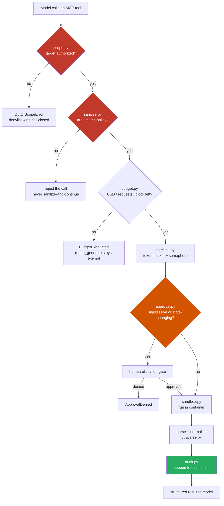
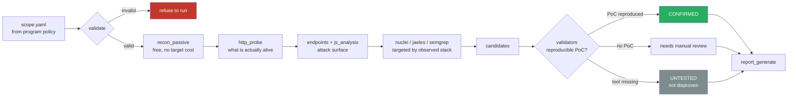

# EasyHunt AI — Architecture

## 1. The one-paragraph version

EasyHunt is a **control plane wrapped around 82 catalogued open-source security tools**.
The model decides *what* to test. The MCP server decides *whether that is allowed*
and enforces it in code. The engines do the work inside a sandbox. Every call is
audited. The security properties live in the server, never in the prompt — because
a prompt can be talked out of its instructions and a function call cannot.

---

## 2. The whole system in one picture

```mermaid
flowchart TB
    subgraph L5["L5 · Strategy — you"]
        S1["Claude CLI"]
        S2["picks targets and phases"]
        S3["reads findings, decides next move"]
    end

    subgraph L4["L4 · Method"]
        M1["skills/ — recon, scan, validate, takeover, cloud, triage, report"]
        M2["taskflows/ — default-triage.yaml"]
    end

    subgraph L3["L3 · Control Plane — the security boundary"]
        C1["scope.py · denylist wins, fails closed"]
        C2["sanitize.py · rejects, never cleans"]
        C3["budget.py · USD + requests + wall clock"]
        C4["ratelimit.py · token bucket, concurrency semaphore"]
        C5["approval.py · elicitation gate"]
        C6["sandbox.py · docker isolation"]
        C7["audit.py · hash-chained log"]
        C8["auth.py · OAuth 2.1 + PKCE"]
        C9["pins.py · third-party trust"]
    end

    subgraph L2["L2 · Execution"]
        E1["tools/ — recon, dns, ports, http_probe, endpoints, js_analysis, secrets, takeover, cloud, exploitation, llmsec"]
        E2["engines/ — bbot, nuclei, jaeles, semgrep, osmedeus, strix"]
    end

    subgraph L1["L1 · Knowledge"]
        K1["findings.py · Severity, Status"]
        K2["taskgraph.py · penetration task graph"]
        K3["attackgraph.py · reachability"]
        K4["graphmemory.py · Neo4j"]
        K5["memory.py · PoC store"]
        K6["rules/ · nuclei templates, rule packs"]
    end

    L5 --> L4
    L4 --> L3
    L3 --> L2
    L2 --> L1

    style L3 fill:#7f1d1d,color:#fff
    style L2 fill:#1e3a5f,color:#fff
```

---

## 3. The control-plane sequence

**This is the heart of the system.** Every single tool call walks this path.
There is no bypass, no fast path, no "trusted caller" shortcut.

Design rules encoded above, and why each exists:

| Rule | Rationale |
|---|---|
| **Denylist wins over allowlist** | An overlapping entry must resolve to "no". Ambiguity is not permission. |
| **Fail closed** | A scope file that fails to parse denies everything. A broken authorization check must never mean "allow". |
| **Sanitize rejects, never cleans** | "Cleaning" hostile input produces something that looks safe and isn't. Reject and surface the error. |
| **Approval is server-side** | If the model held the gate, prompt injection would open it. |
| **Audit is hash-chained** | A tampered record breaks the chain and is detectable. |
| **`report_generate` is budget-exempt** | Otherwise running out of budget makes it impossible to report what you found — the failure mode eats its own evidence. |

---

## 4. Engagement flow

The three-way outcome is deliberate. Most scanners collapse "I tested and found
nothing" with "I could not test" — that is how a missing binary silently becomes
a clean bill of health. EasyHunt keeps them distinct.

---

## 5. Module map

| Layer | Path | Responsibility |
|---|---|---|
| Control | `control_plane/scope.py` | Authorization boundary. Domains, wildcards, CIDR, octet ranges, regex, URL prefixes. Reserved IPs need explicit `cidrs:`/`ip_ranges:` scoping. |
| Control | `control_plane/sanitize.py` | `ArgPolicy` per tool: allowed flags, value patterns, numeric caps. Plus `sanitize_text()` for prose that never reaches a subprocess. |
| Control | `control_plane/budget.py` | USD, request count, wall clock, per-tool seconds. `llm_disabled` ≠ exhausted. |
| Control | `control_plane/ratelimit.py` | Token bucket at `max_rps`, semaphore at `max_concurrency`. |
| Control | `control_plane/approval.py` | Elicitation backend; `PolicyBackend` for tests. |
| Control | `control_plane/sandbox.py` | Docker execution, image per tool, workspace mount. |
| Control | `control_plane/audit.py` | Hash-chained append-only log. |
| Control | `control_plane/auth.py` | OAuth 2.1 Resource Server, RFC 9728 + RFC 8707, PKCE S256. Refuses non-loopback bind without auth. |
| Control | `control_plane/pins.py` | Third-party artifact trust + pinning. |
| Control | `control_plane/jobs.py` | Long-running job tracking. |
| Exec | `tools/base.py` | `@easyhunt_tool` — the single chokepoint. Every wrapper goes through it. |
| Exec | `tools/common.py` | `CATALOG`, `resolve_binary()` (identity-based, defeats PATH collisions), `run_one()`. |
| Exec | `engines/*.py` | Adapters for bbot, nuclei, jaeles, semgrep, osmedeus, strix. |
| Knowledge | `knowledge/findings.py` | `Severity` (subclasses `str` — see the trap in CLAUDE.md), `Status`. |
| Knowledge | `knowledge/taskgraph.py` | Penetration task graph (VulnBot pattern). |
| Knowledge | `knowledge/attackgraph.py` | Cartography-backed reachability. |
| LLM | `llm/openrouter.py` | 3-tier routing (T0/T1/T2), `models[]` fallbacks, `max_price` ceilings, `cache_control` breakpoints. |
| LLM | `llm/triage.py` | Adversarial triage — falsifier/red-team with canary defense. |
| Report | `report/*.py` | Synthesis, templates, graph rendering (incl. PNG export). |

---

## 6. Why the boundary sits where it does

The single most important design decision: **the MCP server is the security
boundary, not the model.**

A model can be argued with. It can be prompt-injected by a page it scrapes, a
JS file it reads, or a scanner banner it parses. If the scope check lived in the
system prompt, a crafted HTTP response could talk it into scanning a host it
was told not to touch.

So scope, rate limiting, sanitization, and approval are **functions that run
before the subprocess spawns**, and they do not consult the model. The model's
role is to choose well within a space that is already bounded. When it chooses
badly, the boundary holds.

This also means the correct response to `scope_denied` is to stop — not to find
another route. Any feature whose purpose is to work around the boundary is
refused by policy, no matter who asks.

---

## 7. Defense against untrusted input

Scanner output is attacker-influenced data. A page title, a JS comment, or an
HTTP header can carry text designed to hijack the model reading it.

- `_defang()` in `tools/base.py` strips prompt-injection patterns from tool output
  before it reaches the model.
- Triage uses **canary tokens** — if a canary appears in model output, the
  content hijacked the reasoning and the result is discarded.
- Third-party templates and payload lists are **pinned by commit SHA** and vetted
  before use (`control_plane/pins.py`, `docs/PAYLOADS.md`).
- Secrets are masked in *both* the `masked` field and the surrounding `context`
  field — an earlier version leaked full credentials in the context while
  dutifully masking the value.
